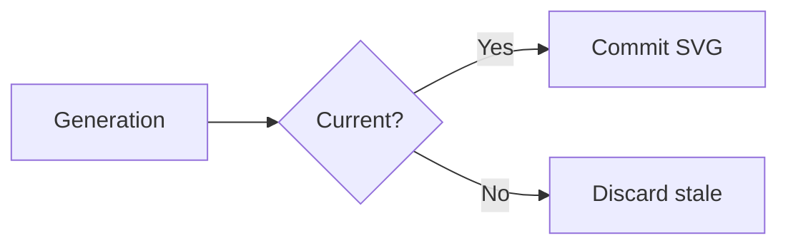
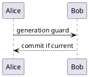

# Async-render generation (ADR 0013) fixture

Host smoke for generation guards on `office-view-markdown.markdownViewer` only.
Pair with `.scratch/async-render-generation/SMOKE.md`.

## Mermaid — edit / Retry target



## Mermaid — intentional fail then edit + Retry

```mermaid
flowchart LR
  THIS IS NOT VALID MERMAID (((broken
```

After AES appears: replace the fence body with a valid flowchart, then click
**Retry**. Expect the new diagram — not the broken snapshot.

## PlantUML — configured path (requires PlantUML Server Base URL)



## Image — broken then Retry


## Prose caret (no focus steal)

Keep the caret in this sentence while diagrams settle. Async complete and Retry
must not yank focus into a figure.
