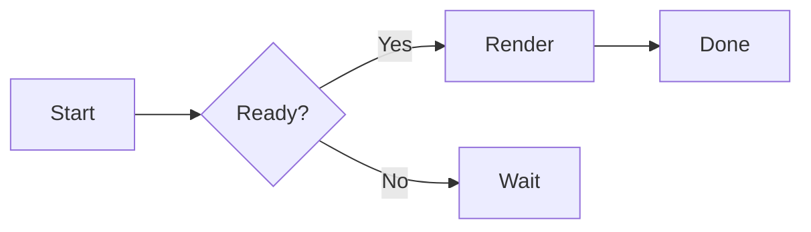
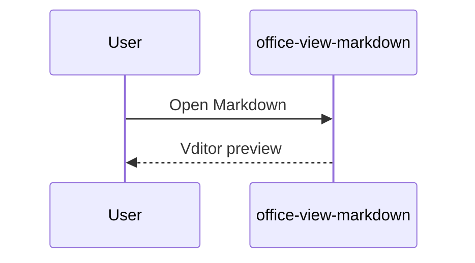
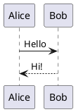
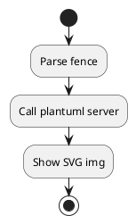

# Diagram smoke fixtures

## Mermaid flowchart

```mermaid
flowchart LR
  A[Start] --> B{Ready?}
  B -->|Yes| C[Render]
  B -->|No| D[Wait]
  C --> E[Done]
```

## Mermaid sequence

```mermaid
sequenceDiagram
  participant User
  participant Ext as office-view-markdown
  User->>Ext: Open Markdown
  Ext-->>User: Vditor preview
```

## PlantUML sequence

```plantuml
@startuml
Alice -> Bob: Hello
Bob --> Alice: Hi!
@enduml
```

## PlantUML activity

```plantuml
@startuml
start
:Parse fence;
:Call plantuml server;
:Show SVG img;
stop
@enduml
```
