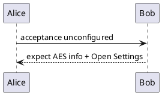
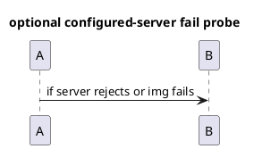

# Failure-honesty AES acceptance fixture

Use with PlantUML server **unset** (empty `office-view-markdown.plantuml.server`).
To unset in VS Code: Settings → search `plantuml.server` → clear the value, or:

```json
"office-view-markdown.plantuml.server": ""
```

Expected AES UIs on this commit (`1213ac5`):

1. **Unconfigured PlantUML** → AES `info` + **Open Settings** (source must not go to a public host).
2. **Mermaid render fail** → AES `error` + **Retry**.
3. **Broken image** → AES `error` + **Retry** (not a bare browser broken-image icon).

---

## 1. PlantUML — unconfigured server path



---

## 2. Mermaid — intentional render failure

```mermaid
flowchart LR
  THIS IS NOT VALID MERMAID (((broken
```

---

## 3. Broken image — 404


Relative path that must 404 under `test/markdown/`.

---

## Optional: PlantUML render/load fail (only if server IS configured)

Leave server empty for scene 1. If you later point at a bad host, this block should show AES `error` + Retry instead of a silent hole:


