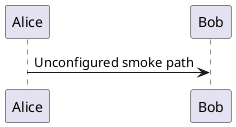

# UX polish smoke sample

This document is the acceptance fixture for the Reading Surface. Use the outline to jump between each polished block.

## GitHub Alerts

> [!NOTE]
> This GitHub Alert is presentation-only; editing must preserve its Markdown marker.

> [!TIP]
> Prefer Design Tokens for radius, shadow, and status colors across chrome.

> [!IMPORTANT]
> Frontmatter Presentation chips must keep all authored multi-value fields visible.

> [!WARNING] PlantUML privacy
> The unconfigured PlantUML state must offer Open Settings without sending this source to a default server.

> [!CAUTION]
> Do not inject presentation wrappers that break WYSIWYG paragraph structure.

This ordinary blockquote remains an ordinary blockquote.

## Tables and tasks

| Surface | Treatment |
| --- | --- |
| Reading Surface | Native VS Code font and bounded measure |
| Code block | Human-readable language label and copy feedback |

- [ ] Verify the table row hover state.
- [x] Verify the task checkbox remains interactive.

## Images and inline code


Inline `office-view-markdown.editorFontSize` should have a quiet token-backed border.

## Code and diagrams

```typescript
export function readingSurfaceIsReady(): boolean {
  return true;
}
```



## Frontmatter Presentation

The default is the editable table. Switch `office-view-markdown.frontMatterPresentation` to `chips` to preview short metadata as compact, editable chips.
